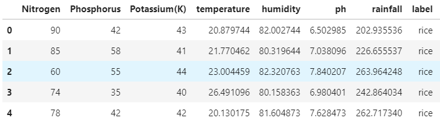
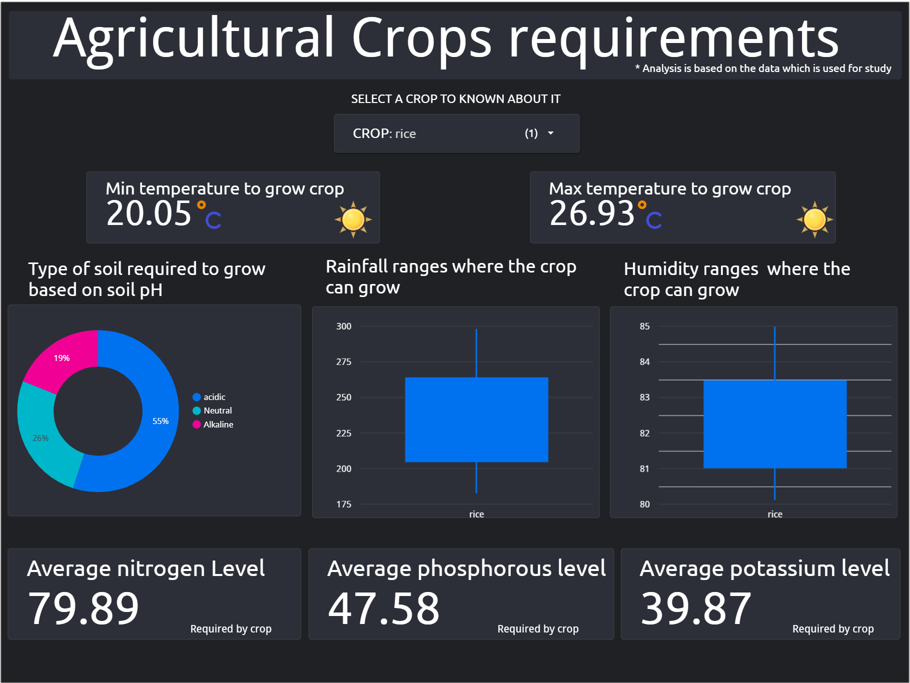

# Crop Recommendation model:

- The common problem existing among the Indian farmers is they don’t choose the right crop based on their soil requirements. Due to this, they face a serious setback in productivity. if they can choose the right crop for the cultivation based on soil and environmental factors yield of the crop will be increases and farmers can get better profits. The main aim of the project is to analyze the main features to predict the crop and help farmer's in predicting the right crop for their land.

- Data has been taken from the [Kaggel Crop Recomendation Data](https://www.kaggle.com/atharvaingle/crop-recommendation-dataset)
-  This data contains 7 features 
   - `Nitrogen` - ratio of Nitrogen content in soil.
   - `Phosphorous` - ratio of Phosphorous content in soil.
   - `Potassium` - ratio of Potassium content in soil.
   - `temperature` - temperature in degree Celsius.
   - `humidity` - relative humidity in %.
   - `ph` - ph value of the soil.
   - `rainfall` - rainfall in mm.
- Overview of the data
  

- The cleaned and preprocessed data has been used to build a machine learning model, a Decision tree. With an accuracy of 99%, the model can able to predict the right crop based on the soil composition and weather conditions of the agricultural land.

- Crops wize data analysis has been done on the google studios and created a dashboard [Click hear](https://datastudio.google.com/reporting/2129d913-26cf-43c3-80a7-ba00fd62ce79/page/Ivx) to check out an intractive dashboard .

