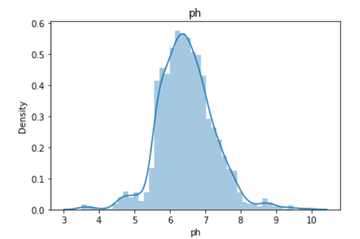
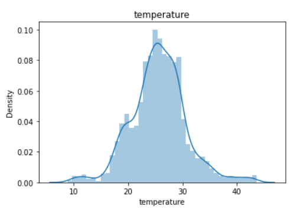

## DATA
- <b>SOURCE - </b> Data has been taken from the [Kaggel Crop Recomendation Data](https://www.kaggle.com/atharvaingle/crop-recommendation-dataset)
-  This data contains 7 features 
   - `Nitrogen` - ratio of Nitrogen content in soil.
   - `Phosphorous` - ratio of Phosphorous content in soil.
   - `Potassium` - ratio of Potassium content in soil.
   - `temperature` - temperature in degree Celsius.
   - `humidity` - relative humidity in %.
   - `ph` - ph value of the soil.
   - `rainfall` - rainfall in mm.
- Overview of the data
  

## DATA PREPROCESSING

- Data preprocessing plays an important role in your workflow. You need to transform data in a way that the computer would be able to work with it .    Real-world data is often incomplete, inconsistent, , and is likely to contain many errors. Data preprocessing is a proven method of resolving such issues. Data preprocessing prepares raw data for further processing.
- By preprocessing data:

  - `Make our database more accurate` -  We eliminate the incorrect or missing values that are there as a result of the human factor or bugs.identify or remove outliers.
  - `Boost consistency` -  When there are inconsistencies in data or duplicates, it affects the accuracy of the results.
  - `Make the database more complete` - We can fill in the attributes that are missing if needed.
  - `Smooth the data` -  This way we make it easier to use and interpret.

## Missing Values

- Missing data are the values where some of the observations in a dataset are blank and no value is stored in the variable in an observation. Missing values can cause errors in the data and reduce the statistical power of the data. You have to remove them or replace them with suitable values.

- In this dataset, there are no missing values or any kind of null values.

## Outlier's

- Outliers are something which is an odd-one-out or the one that differs from the crowd, Outliers may occur while error in collecting the data or while entering the data, you have to remove or replace the outliers from the data, otherwise, outliers can spoil and mislead the training process resulting in larger training times,  less accurate model and poor results.

- Outliers can be detected by various methods, Method used for this data is Interquartile Rule to Find Outliers, in this method you have to calculate the interquartile range (IQR) for each variable and multiply it by 1.5 then add 1.5 x (IQR) to the third quartile. Any number greater than this is a suspected outlier and Subtract 1.5 x (IQR) from the first quartile. Any number less than this is a suspected outlier.

- For this data you cant find to all the data combinly, you have to find outliers for each crop beacause  requirements ranges with respect to each crop may vary. For example, if we take crops like muskmelon, watermelon, and rice. Rainfall ranges require to grow muskmelon is 20-30 cm, for watermelon 40-50 cm but rice 180 - 290 cm . for this data if you apply  Interquartile Rule to find outliers it will detect rainfall ranges for rice as outliers, but they are no the outliers. Hence you have to calculate outliers at each class level.  

- There are no outliers present in data, you can visulize outliers if they present in the boxplot graph(a simple way of representing statistical data on a plot in which a rectangle is drawn to represent the second and third quartiles, usually with a vertical line inside to indicate the median value. The lower and upper quartiles are shown as horizontal lines either side of the rectangle.)

    

-  For clear veiw [click here](https://github.com/mohansaimandalapu/MachineLearningProjects/tree/main/Agriculture%20Project)

## Feature scaling
-   

  

    
     
    
    
     
    
      
  

# Exploratory data analysis
## Ouestion 1 :
  Plot correlation matrix and show which features are related to each other and explain why they are related to each other, check whether there is multicollinearity between the variables and explain dose multicollinearity affects the model?

  <b>Answer -:</b> Correlation tells us that how each feature in our data is related to each other. correlation is measured from -1 to +1. Towards negative indicates features are negatively co-related, toward positive indicates that features are positively co-related to each other, and towards zero indicates no correlation between the features.
 
 - <b>Correlation Matrix</b>
   
- From the correlation matrix, you can see potassium and phosphorous are 74% positively co-related to each other. Other than that remaining features are negligibly related to each other.

## Ouestion 2 :

Name the crops that can grow by farmers where there is very less rainfall conditions and very rainfall conditions  and name the crops that can adapt to wide range of rainfall conditions.
- Consider:
  - Low rainfall condition = rainfall less than 50cm
  - High rainfall condition = rainfall above 200cm

<b>Answer : </b> 
- crops that can grow in low rainfall conditions are :-

- Crops that can grow grow in high rainfall regions are:-

- You can see from  the above tabels <b>papaya</b> is common in both low rainfall and high rainfall crops . papaya is adapted to a wide range of rainfall conditions ranging from 35 cm to 250 cm annual precipitation.you can see in below boxplot average rainfall required for papaya is arround 140cm but it can adapt to 35cm - 250cm of rainfall.

## Question 3:

- <b>Question A :</b> Classify the type of soil of crops based on their pH range into Alkaline , Acidic and Neutral 
- <b>Question B :</b> Check wether there is relation between the teperature, humidity and rainfall requirements of crops  based on the type of soil they grow. 

<b>Answer A :</b>
- From landscape for life research paper you can classify soil based on therir ph value as fallows-
    - `Acidic` - pH less then 6.5
    -  `Neutral` - pH between 6.5-7.5
    - `Alkaline` - pH above 7.5

- With reference of above data crops are classified as fallows-

<b>Answer B :</b> `Todo` Check whether thre is a relation between soil type and temperature humidity and rainfall

## Question 4

Plot worldcloud of crops and highligh the crops that requires high ammount of nitrogen , phosphorous , pottasium.

<b>Answer:</b>

    
     
    

- From 1st worldcloud you can see nitrogen rich crops that are Cotton, Coffee, Banana and muskmelon
- From 2nd worldcloud you can see Potassium rich crops that are Grapes, Apple, Chickpea and muskmelon
- From 3rd worldcloud you can see Posporous  rich crops that are Apple, Grapes, Banana and Blackgram.

## Question 5

 Name the crops which can grow by farmers in wide range of temperature, and name the crops which can srvive on low temperature regions and high temperature regions.
 - Consider
   - High temperature = above 35°C
   - low temperature = below 20°C

<b>Answer :</b> Crops that can adapt to wide range of temperature means crop must be abel to survive between wide temperature ranges. from the bar plot below orange bar indicates minimum temperature and blue colour indicates maximum temperature. From this you can see crops like <b>Grapes</b> has temperture range between <b> 8°C-41°C</b> and <b>Orange</b> has a temperature range between <b>23°C - 41°C</b>. This two crops has a ability to survive in a wide range of temperature.

- High temperature crops 

- Low temperature crops 

<b>Crops wize data analysis has benn done on the google studios and created a dashboard [Click hear](https://datastudio.google.com/reporting/2129d913-26cf-43c3-80a7-ba00fd62ce79/page/Ivx) to check out .</b>