<h1 align="center">INDIAN CROP RECOMENDATION SYSTEM</h1> 

# Aim of the project - 
-  Agriculture is an important part of India's economy and at present it is among the <b>top two</b> farm producers in the world. This sector provides approximately <b>52 percent</b> of the total number of <b>jobs available in India</b> and contributes around <b>16 percent</b> to the GDP. Agriculture is the only means of living for almost two-thirds of the employed class in India. As being stated by the economic data of financial year 2006-07, agriculture has acquired <b>18 percent of India's GDP</b>. The agriculture sector of India has occupied almost <b>43percent of India's geographical area</b>.
-  Agriculture in India plays a predominant role in economy and employment. The common problem existing among the Indian farmers are majority of them don’t choose the right crop based on their soil requirements. Due to this they face a serious setback in productivity. if they can choose right crop for the cultivation based on soil and environmental factores, <b>yeild</b> of the crop will be increases and famers can get better profits.
- This model is bulit to solve this problem as much as possible and hope this model will help farmers in selecting main crop which is suitable for the soil.

# Data

- <b>SOURCE</b> 
    - Data hase been taken from the <a href="https://www.kaggle.com/atharvaingle/crop-recommendation-dataset">Kaggle : Kaggle Crop recomendation dataset</a> ,  <b>Data contains 7 coloumns</b> 

- <b> Data overview</b>-
    
    - columns like N P and K are renamed as Nitrogen Phosphorous and Potassion
    
    - There are no null values in the data 
    - Checking for outliers has been done for each class coloumn level , and no outliers are detected.
    - New column called soil type has been added to the data based on the soil ph - 
     
    - According to this chart soil type is devided into 3 types , ALlkaline (soil which have ph above 7.3),Acidic(soil having pH below 6.5) and Neutral (soil having pH between 6.6-7.3)

- <b>PH</b>
    
    - Soil pH plays an importent role in the growth of the plant , Soil pH is the value measure of <b>acidity</b> and <b>alkalinity</b> it possess. Soil pH value is considered as one of the most vital factor which may determine the yield of the crops. Soil pH is important because a soil’s acidity or alkalinity determines what plant nutrients are available to plant roots. Nutrients in the soil—elements such as nitrogen, phosphorus, and potassium—become available to plants when they dissolve in water or soil moisture. Most plant nutrients will not dissolve when the soil is either too acidic or too alkaline.
    - <b>Effect of pH on plant growth</b>
    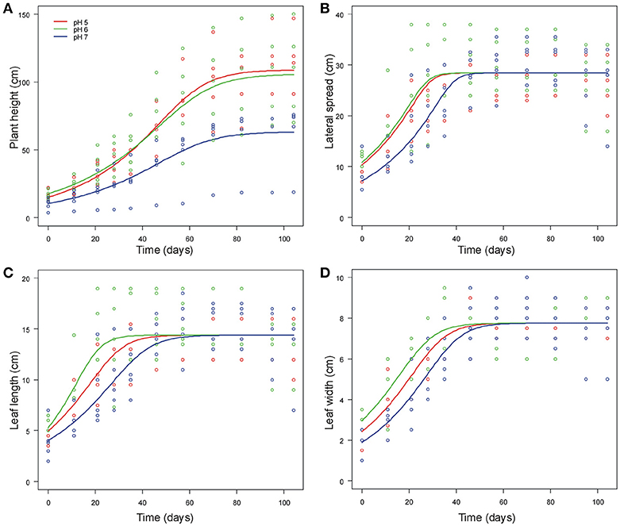
    
    - <b>Plant height</b> - Plant will grow faster for soil having  <b>pH5</b> as shown in the above graph and slow for pH6 this indicates that with less ph in the soil will be faster the growth 
    - <b>Lateral spread, Leaf length, and width</b> will grow faster to a certain period with <b>Neutral pH(6)</b> And decrease with increase or decrease in pH value.

- <b>Temperature and Humudity</b>
    - <b>Temapreture</b> is the measure of heat wheras <b>Humidity</b> is a measure of the amount of water vapor in the air.
    -   <b>Effect of Temperature</b> - High temperature, even for short period, affects crop growth especially in temperate crops like wheat. High air temperature reduces the growth of shoots and in turn reduces root growth. High soil temperature is more crucial as damage to the roots is severe resulting in substantial reduction in shoot growth.
    - <b>Effect of Humidity</b> - When conditions are too humid, it may promote the growth of mold and bacteria that cause plants to die and crops to fail, as well as conditions like root or crown rot. Humid conditions also invite the presence of pests, such as fungus gnats, whose larva feed on plant roots and thrive in moist soil.

- <b>Rainfall</b>
    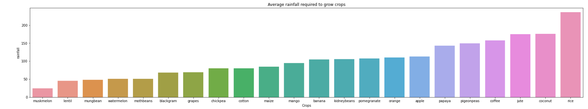
    - Compared to other crops <b>Rice</b> required more rainfall with an average of <b>236cm</b> of rainfall , In india top rice producing states are <b>West bengal , Uttar Pradesh and  Punjab </b>. 
    - <b>Canals</b> constitute an important source of irrigation in <b>Uttar Pradesh.</b>  But the amount of rainfall, especially in western parts of the state, is not sufficient for sustained agricultural growth.Therefore, a large number of canals have been constructed to provide regular supply of sufficient water to the crops. Uttar Pradesh has about <b>3,091</b> thousand hectares under canal irrigation which is <b>30.91% of the total canal irrigated area of the country.</b> Over one-fourth of the net irrigated area of the state is irrigated by canals. 
    - As per the information available on the website of Ministry of Agriculture & Cooperation, Government of India, the percentage of cultivated land area that is covered by the Irrigation in different areas of Punjab is about </b>97.03%.</b> 
    - West bengal is the state which has the <b>9th highest rainfall in india.</b>
- <b>Nutrients in soil</b>
    - The nutrients that are required by crops in the largest amounts are <b>Nitrogen</b>, <b>Phosphorus</b> and <b>Potassium(K)	</b>. For that reason, they are often considered as the <b>most important nutrients</b>.
    - The main functions of N and P are that they are constituents of <b>proteins</b> and <b>nucleic acids</b>, which are important components of <b>plant tissue.</b> K is the only nutrient that is not a constituent of organic plant compounds, but is mainly of importance in the regulation of processes in the plant, such as <b>osmosis</b> and <b>enzyme activities.</b> K is generally playing an important role for the <b>quality</b> of harvested plant products.
    - For the optimal growth of crops, sufficient amounts of nutrients should be available in the <b>root zone</b> of the crops. Those nutrients can be partly supplied by the soil and should be partly added with organic manures and <b>fertilizers.</b> Soils will contain different amounts of available nutrients, depending of the parent material (e.g. sand, clay, peat), and differences in the management history such as preceding crops, management of crop residues and use of manure and fertilizers in the past. Also differences in <b>climatic conditions</b> may alter the available nutrients. For that reason, it is of importance for farmers to know the NPK content of their soil, so that they know how much N, P and/or K they should add with organic or mineral fertilizers, to optimize crop growth, production and yield.
    - The availability of N, P and K in soil should be sufficient, but not too high. Too low availabilities will lead to <b>hampered growth</b> and <b>low yields</b>, while too high availabilities of one or more nutrients may lead to <b>disturbed plant growth</b> and <b>adverse effects for yield and/or quality of harvested products</b>. Moreover, the N, P and K availability should be <b>balanced</b> , so the availability of the other nutrients should be taken into account while the availability of the considered nutrient is adjusted.
    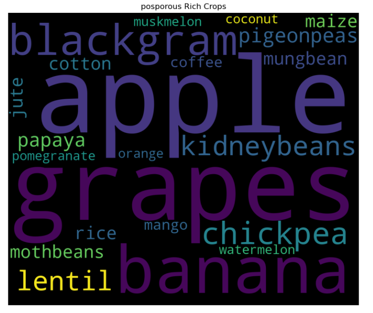
    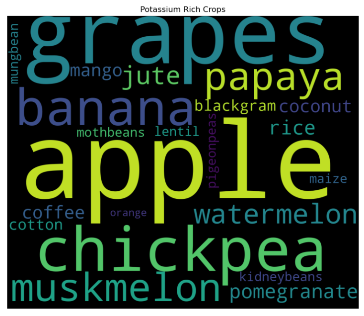
    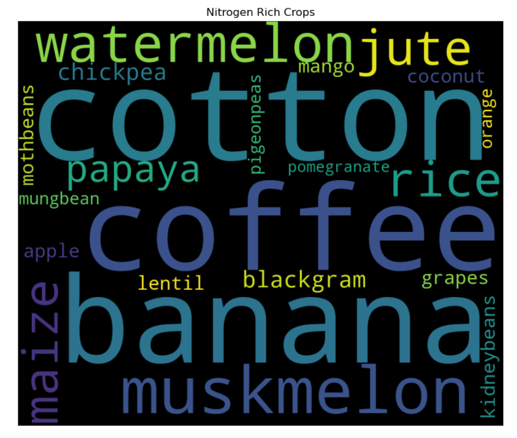
    - This are the world cloud plots that are obtained by the data.
- <b>Data Analysis</b>
    - Data analysis has been  for crop wize and created a dashboard on google data studios
    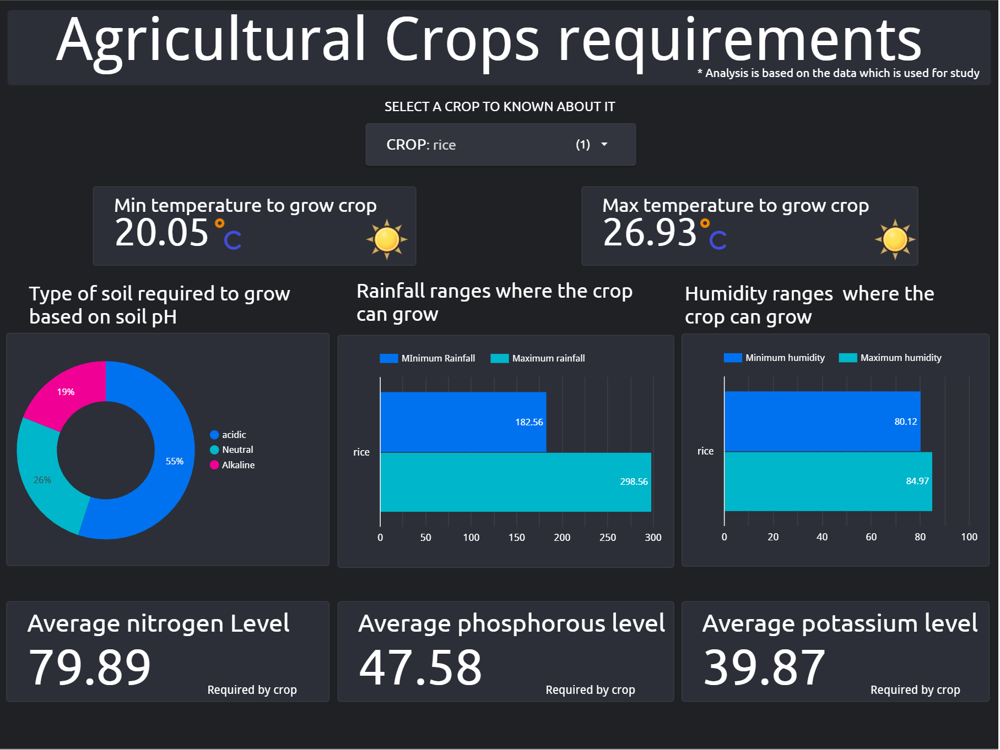
    - Click <a href="https://datastudio.google.com/s/vKmP1ksHiz4">here to see <b>DASHBOARD</b></a>

 # MODEL
- <b>selecting model</b>
    - A decision tree is the best model for the project because we want a model which is just not predicting the output but also to visualize the pattern of predicting and how it's predicting and it can help in conveying to the framers that which factors are deciding the crops and what are the main factors influencing in predicting the type of the crops to be cultivated and help them in increasing the profits. 
    - Phosphorous and Potassium are highly co-related to each other which leads to Multicollinearity in the data and the Decision tree will not be affected by the Multicollinearity.

- <b>training Model</b>
    - The model is built on the train data and confusion matrix of the trained model is - 
    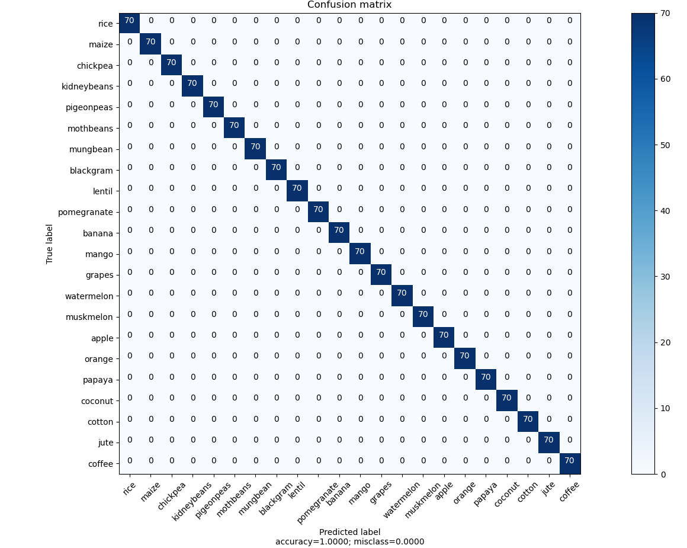
    - model is trained very well with an accurecy of 100% and Recall and precision of 100%

- <b>Testing model</b>
    - Decision tree which is trained above is used for test data and the results are - 
    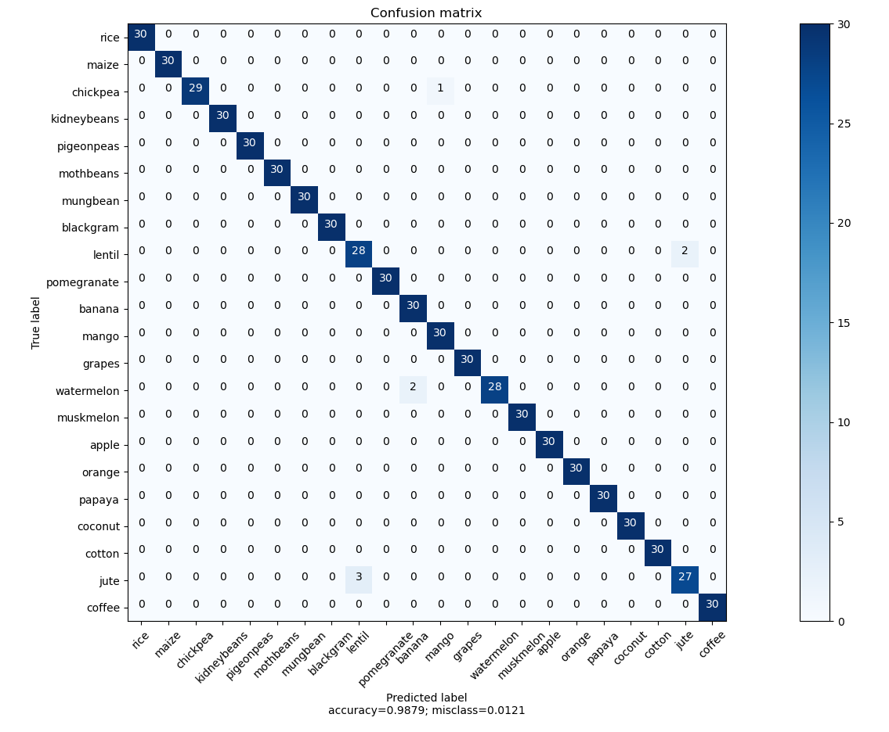

- <b>Overfitting</b>
    - Model is predicting jute as lentil, watermelon as banana, lentil as jute, and chickpea as mango but in model training, it has correctly identified, this is because of overfitting of the model in Model training. 
    - Over-fitting is the phenomenon in which the learning system tightly fits the given training data so much that it would be inaccurate in predicting the outcomes of the untrained data.
    - In decision trees, over-fitting occurs when the tree is designed to perfectly fit all samples in the training data set. Thus it ends up with branches with strict rules of sparse data. Thus this affects the accuracy when predicting samples that are not part of the training set.
    - One of the methods used to address over-fitting in the decision tree is called pruning which is done after the initial training is complete. In pruning, you trim off the branches of the tree, i.e., remove the decision nodes starting from the leaf node such that the overall accuracy is not disturbed.

- <b>Hyperparameter tuning</b>
    - A Machine Learning model is defined as a mathematical model with a number of parameters that need to be learned from the data. By training a model with existing data, we are able to fit the model parameters.However, there is another kind of parameters, known as Hyperparameters, that cannot be directly learned from the regular training process. They are usually fixed before the actual training process begins. These parameters express important properties of the model such as its complexity or how fast it should learn.
    - in decision tree also there are hyperparameter tuning which imporve the performance of the model
    - hyperparameters that can tune are as fallows
    - <b>criterion</b>

        - If you ever wondered how decision tree nodes are split, it is by using impurity. Impurity is a measure of the homogeneity of the labels on a node. There are many ways to implement the impurity measure, two of which scikit-learn has implemented is the <b>Information gain</b> and <b>Gini Impurity</b> or Gini Index.
        - Information gain uses the entropy measure as the impurity measure and splits a node such that it gives the most amount of information gain. 
        - The Gini impurity measure is one of the methods used in decision tree algorithms to decide the optimal split from a root node, and subsequent splits. ... Def: Gini Impurity tells us what is the probability of misclassifying an observation. Note that the lower the Gini the better the split\.
        </b> <b>Entropy fromula</b></img>
        </b> 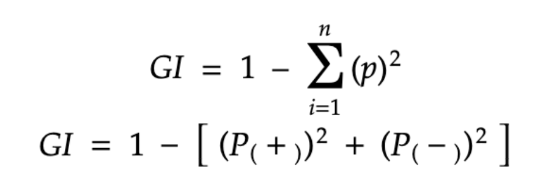<b>Gini fromula</b></img>

        - <b>*Note - </b>  <b>Gini impurity is the default selection criterion for the decision tree</b> 

        - Decision tree model which is built on the Entropy selection criterion predicting same as the model with ginni index as selection criterion. There is no big diffrence in the performance of the model hence for further tunning Decision tree with ginni impurity will be used.
    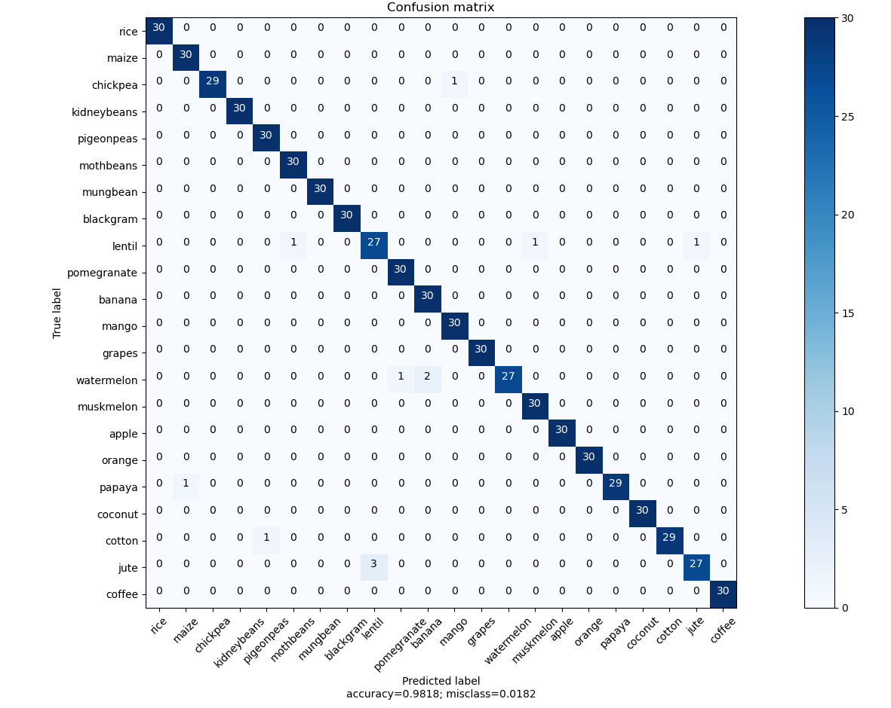

    - <b>Depth of tree and Minimum sample leaf</b>
        - The DecisionTreeClassifier provides parameters such as <b>min_samples_leaf</b> (The minimum number of samples required to be at a leaf node.) and <b>max_depth</b> The maximum depth of the tree to prevent a tree from overfiting. <b>Cost complexity</b> pruning provides another option to control the size of a tree. In DecisionTreeClassifier, this pruning technique is parameterized by the cost complexity parameter, <b>ccp_alpha.</b> Greater values of ccp_alpha increase the <b>number of nodes pruned.</b> 
        - Minimal cost complexity pruning recursively finds the node with the <b>“weakest link”.</b> The weakest link is characterized by an <b>effective alpha</b>, where the nodes with the smallest effective alpha are <b>pruned first.</b> To get an idea of what values of ccp_alpha could be appropriate, scikit-learn provides <b>DecisionTreeClassifier.cost_complexity_pruning_path</b> that returns the effective alphas and the corresponding total leaf impurities at each step of the pruning process. As <b>alpha increases, more of the tree is pruned</b>, which increases the total impurity of its leaves.

        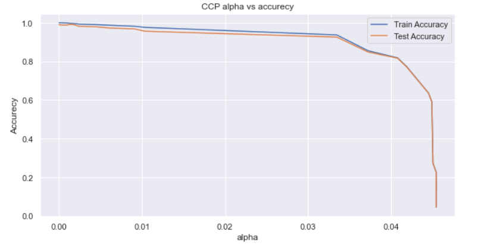
        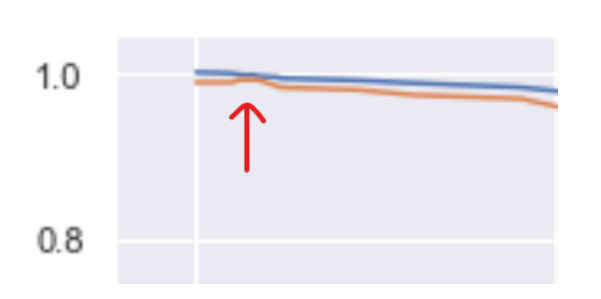

        - The above graph is plotted between the accuracy score with  different alpha values, from the graph it has been pointed out that alpha value which is somewhere in between 0 and 0.01 for an alpha value model is predicting best for test and train as shown in the image above but we are not getting a clear value of that particular alpha from seeing graph so we have to find the value of alpha that is in between 0 and 0.01 to the model and we can get the best alpha value by calculating recall and precision scores that are given by the model for different alpha values.
        - By taking first 5 values it has been pointed out that alpha value with 0.0012185866081969973 gives a best results 
            - Recall =  0.99091 
            - precision = 0.99156
        - And the confusion matrix for the model bilt with alpha value mentioned above 
        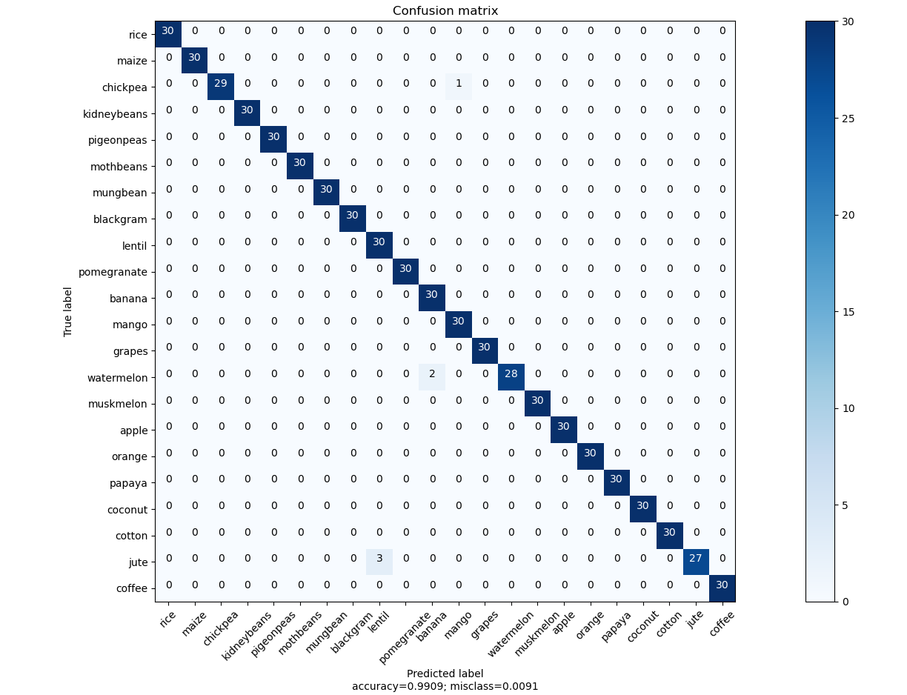
        - <b>Decision tree accurecy is increased by 1% after doing hyperparameter tunning.</b> 
    - <b>Visulizing a decision tree</b>
    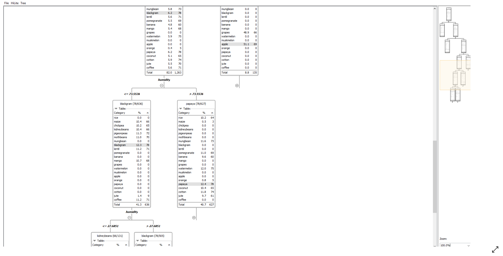
        -  Above image is the part of a decision tree that is build  in <b>KNIME</b> visulizing tool , by seeing this <b>HUMIDITY</b> is dividing the  <b>80%</b> of the total data into 2 equal part , this means humidity is playing a very cruicial role in decision tree 
        - Crops like maize,chikpea,kidneybeanes,pigeonpeas,mothbeans,blackgram,lentil,mango and coffe are the crops which are having the humudity less or equal to 73.55.

# RESULT'S
-  ROC and AUC curve
    - AUC - ROC curve is a performance measurement for the classification problems at various threshold settings. ROC is a probability curve and AUC represents the degree or measure of separability. It tells how much the model is capable of distinguishing between classes. Higher the AUC, the better the model is at predicting 0s as 0s and 1s as 1s. By analogy, the Higher the AUC, the better the model is at distinguishing between class.
    - An excellent model has AUC near to the 1 which means it has a good measure of separability. A poor model has AUC near to the 0 which means it has the worst measure of separability. In fact, it means it is reciprocating the result. It is predicting 0s as 1s and 1s as 0s. And when AUC is 0.5, it means the model has no class separation capacity whatsoever.
    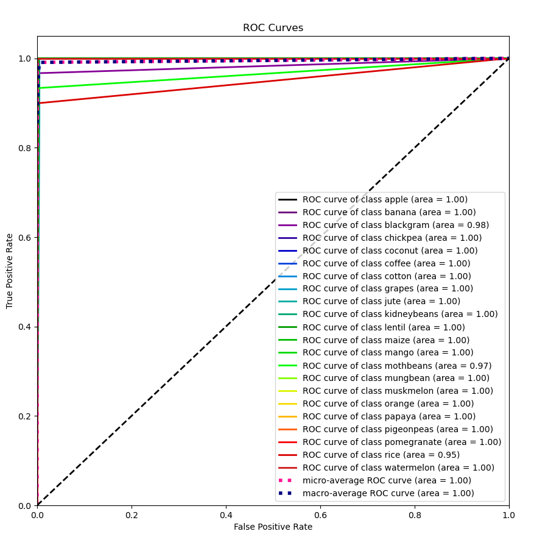
    - <b>The farmers can rely on this model because this model can help farmers in predicting suitable crops with an accuracy of 99%. and help them in selecting the best crop for their soil. which will improve the yield of the crop and farmers may get profits.</b>
    - <b>From this model we can convey to farmers which are the important factors that can affect crop selection, and from the decision tree, it has been pointed out that Humidity plays an important role in classifying the crops, so farmers should be very careful while collecting the data of different factors in their environment and soil.</b> 