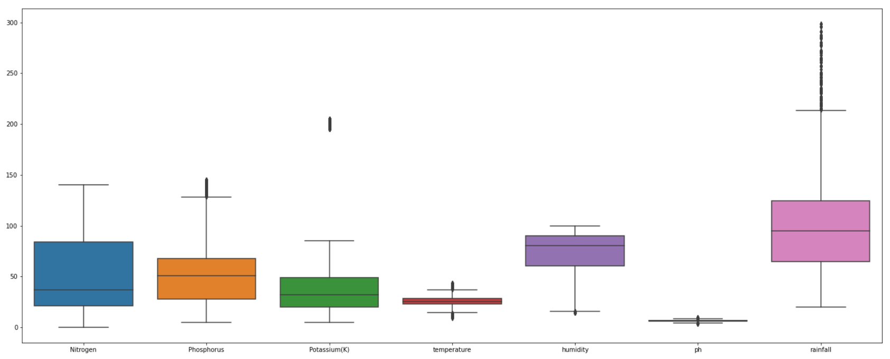
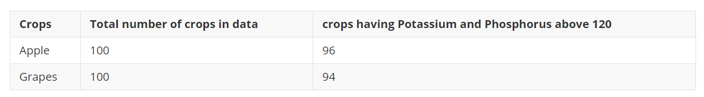
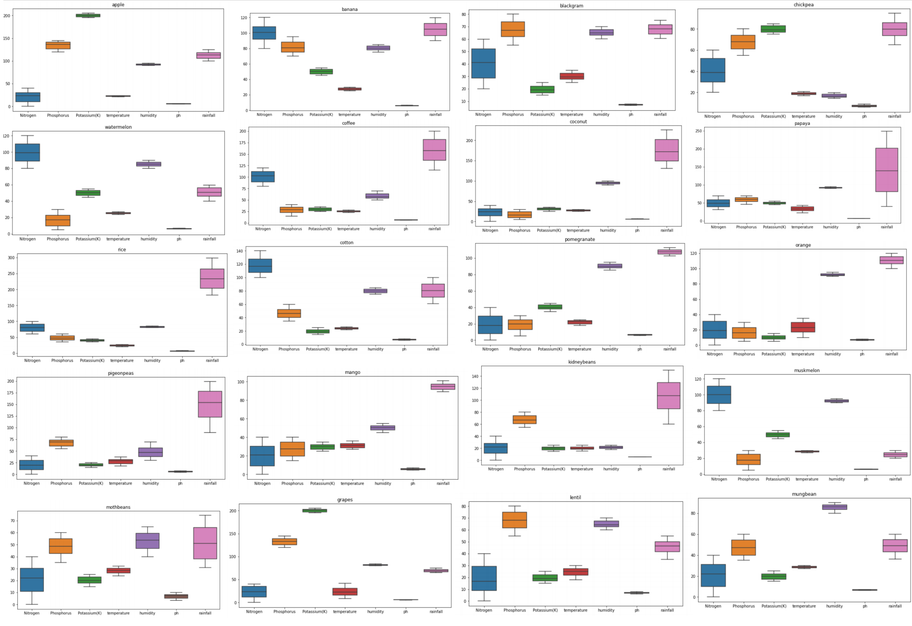

# DATA PREPROCESIING
## What is data preprocessing why do we need data preprocessing
- Data preprocessing plays an important role in your workflow. You need to transform data in a way that the computer would be able to work with it.
- By preprocessing data:
    - `Make our database more accurate` -  We eliminate the incorrect or missing values that are there as a result of the human factor or bugs.
    - `Boost consistency` -  When there are inconsistencies in data or duplicates, it affects the accuracy of the results.
    - `Make the database more complete` - We can fill in the attributes that are missing if needed.
    - `Smooth the data` -  This way we make it easier to use and interpret.

## Missing Values 
- Fortunaltly we dont have any missing values or null values in this data set.

## Outliers
- Outliers are something which is an odd-one-out or the one that differs from the crowd, Outliers may occur while error in collecting the data or while entering the data, you have to remove or replace the outliers from the data, otherwise, outliers can spoil and mislead the training process resulting in larger training times,  less accurate model and poor results.
- Outliers can be visualized by using a boxplot graph for each variable.

- From the 

