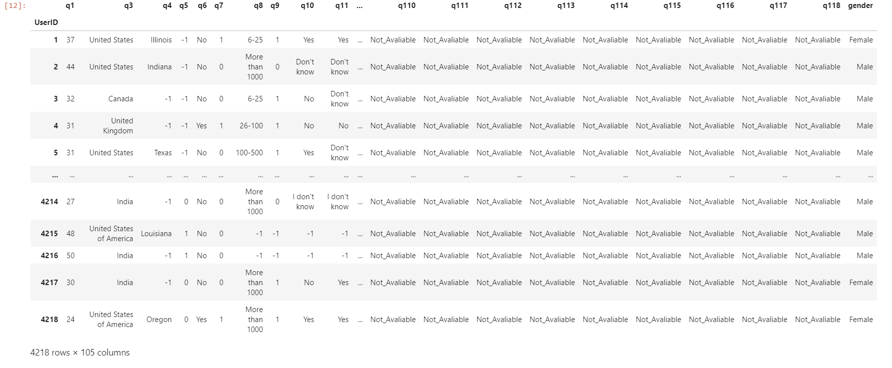

# Mental Illness In Tech Industry

## Techie quiet battle with depression

The Tech and startup world is built on the backs of incredibly bright minds. It's known for its innovation and resilience and a culture that fosters high-productivity. But it has a dark underbelly.

Everyone around the world has mental health, but not everyone talks about it.According to OSMI data (open source mental illness survey), 51% of tech professionals have been diagnosed with a mental health condition. By comparison, 19.1% of U.S. adults experience mental illness, according to the National Alliance on Mental Illness.

This repository makes an effort to shed light on the mental health issues in Tech industry and how tech employees struggle through these illness. Furthermore, exploration on how Employers support and mitigate these situations at workplace has been done.

# DATA

## Source -:

Open-source mental illness survey (OSMI) from 2014-2019 has been used for the analysis.

    
By using this resources created a dataset which is easy for analysis

# Incredible insights
 

 

# World cloud of insights

