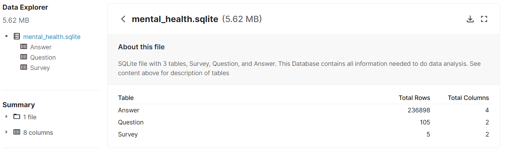
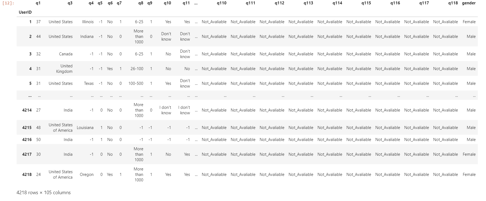
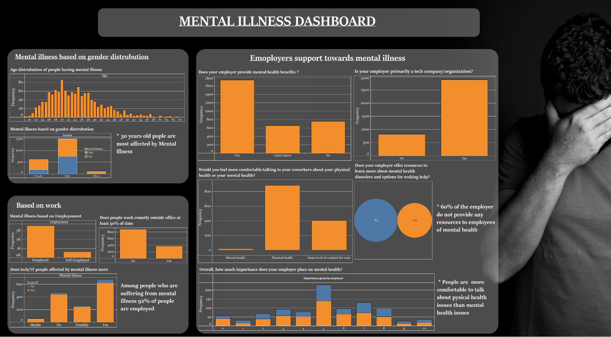
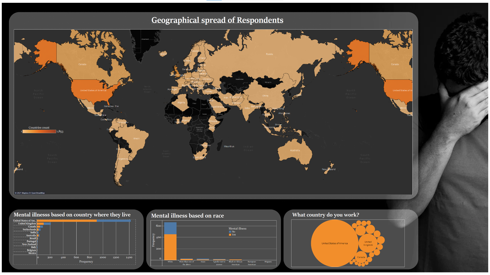
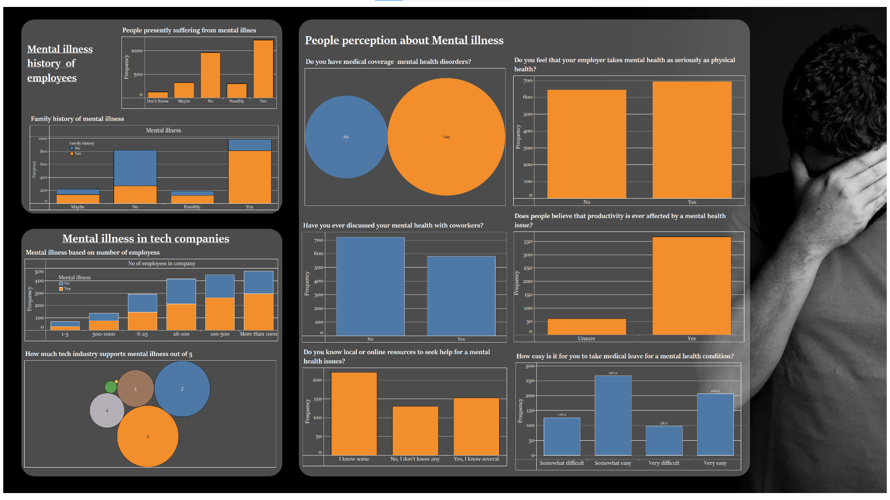

# Mental Illness In Tech Industry

## Tech’s quiet battle with depression

    The tech and startup world is built on the backs of incredibly bright minds. It's known for its innovation and resilience and a culture that fosters high-productivity.

    But it has a dark underbelly. 

    In this repository, you will know about mental illness and what people thinking about mental illness, Dose most people are aware of mental illness.

    <!--A study by Michael Freeman found that entrepreneurs are 50% more likely to report having a mental health condition

     Everyone around the world has mental health, but not everyone talks about it.According to OSMI data (open source mental illness survey), 51% of tech professionals have been diagnosed with a mental health condition. By comparison, 19.1% of U.S. adults experience mental illness, according to the National Alliance on Mental Illness.  -->

# DATA

## Source -:

    The data used in this analysis is Kaggle Survey on Mental Health in the Tech Workplace in 2014, 2016, 2017, 2018, 2019 by OSMI(open-source mental illness survey)

    Kaggle dataset has SQLite file with 3 tables, Survey, Question, and Answer.

    
    By combining these three tables I have created a table called user_table, which is used in this analysis

# Data Analysis

I have analyzed the data and created a dashboard 

# insights
    -  Employer's support toward mental illness is less than the support towards physical health.
    -  Employees are not comfortable talking about their mental health condition with their co-workers. 
